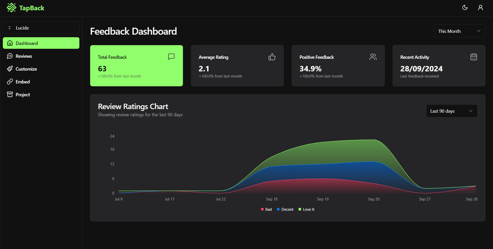
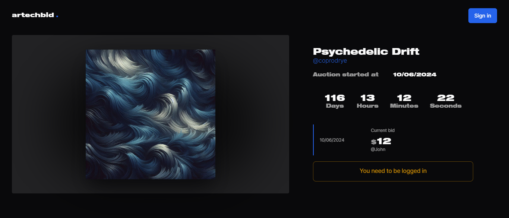

# Hi, I'm Jeel — I build products for the web

Full-stack developer from India, focused on turning product ideas into polished,
useful software. I enjoy owning the whole journey: shaping an interface, designing
the data model, building the API, and shipping the result.

My sweet spot is **TypeScript + React/Next.js**, especially SaaS products,
real-time experiences, and dashboards. Away from the main stack, I am exploring
Rust and sharpening the engineering practices that make software easier to
maintain.

## Selected work

### [TapBack](https://github.com/J3E1/tapback)

[](
https://github.com/J3E1/tapback)

A feedback-widget SaaS with multi-project management, customization, analytics,
and a simple website embed.

`Next.js` · `TypeScript` · `PostgreSQL` · `Prisma`

[Live app](https://tapback.vercel.app/) ·
[Source](https://github.com/J3E1/tapback)

### [Artechbid](https://github.com/J3E1/artechbid)

[](
https://github.com/J3E1/artechbid)

A digital-art auction platform with live bidding, countdowns, outbid
notifications, uploads, and user profiles.

`Next.js` · `TypeScript` · `Firebase` · `NextAuth`

[Source](https://github.com/J3E1/artechbid)

More things I've built:

- [Real-time opinion word cloud](https://github.com/J3E1/realtime-voting) —
  collaborative input powered by Socket.IO and MongoDB.
- [Litter](https://github.com/J3E1/twitter-clone-next-14) — a full-stack
  social app with profiles, posts, media, follows, and notifications.
- [careX](https://github.com/J3E1/careX) — a cyberpunk-styled patient
  appointment manager.

## How I work

```text
idea → interface → data model → API → production
```

I care about clear product flows, maintainable systems, and the small details that
make software feel considered. My regular toolkit includes TypeScript, React,
Next.js, Node.js, Tailwind CSS, PostgreSQL, MongoDB, Prisma, Firebase, and Redis.

## Let's connect

I am always happy to talk about web products, engineering ideas, and interesting
problems.

[Email me](mailto:khumanjeel@gmail.com) ·
[Connect on LinkedIn](https://www.linkedin.com/in/jeel-khuman/) ·
[Explore my repositories](https://github.com/J3E1?tab=repositories)
